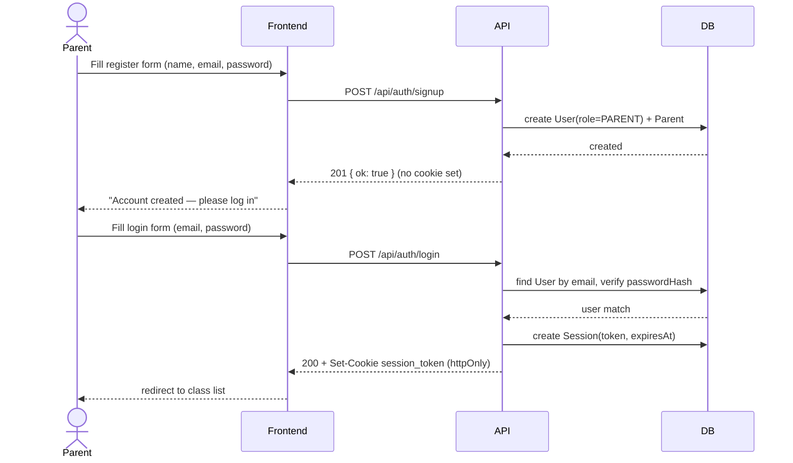
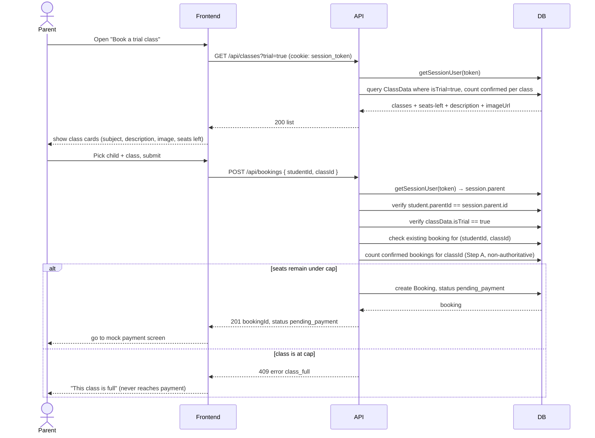
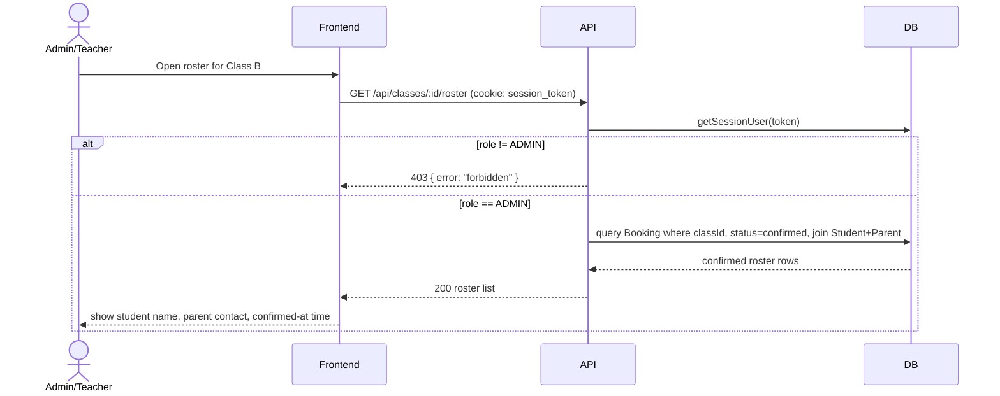

# Tech Design — Ottodot Trial Booking

Scope: **trial booking only** (no regular enrollment). Trial classes are capped at **4 confirmed students**. This document is the authoritative backend/data design; `AGENT_BUILD_PROMPT.md` implements against it.

Stack: **Next.js 14+ (App Router, TypeScript) + Prisma + SQLite**. Chosen for zero external-account setup (`npm install && npm run dev` just works), a single-language full-stack app, and because SQLite's single-writer transaction model makes the concurrency story easy to reason about and to explain in a README, while the same transaction shape ports cleanly to Postgres (noted inline below) if this were to go to production.

---

## Assumptions

These are assumptions this design makes, not confirmed facts about Ottodot's real systems — called out explicitly here (and repeated in the README's "assumptions" section) rather than left implicit in the schema.

- **`ClassData` already exists elsewhere (the big one).** This design assumes a general class/course entity is already owned and populated by another system (a course catalog / scheduling service), and that this booking system is a downstream consumer of it, not its owner. Concretely, that means:
  - `ClassData` is modeled here only because there's no real upstream system to integrate with for a take-home — in production this table (or its equivalent API) would not be created by this project at all; it would be read from wherever Ottodot already keeps class/course data.
  - This booking system **never writes to `ClassData`** — no create/update/delete path touches it anywhere in §5–§8. Seed data is a stand-in for "the sync job that would populate it from the real catalog system already ran."
  - "Trial" is modeled as an `isTrial` flag on that shared entity (a *mode* a class is offered in) rather than a separate `TrialClass` table, because a real catalog system almost certainly represents trial-vs-regular as an attribute of one class concept, not two unrelated ones.
  - The trial-specific 4-seat cap is therefore **deliberately decoupled** from `classData.capacity` (§5) — that field is assumed to belong to the other system's regular-enrollment concern, not this one.
  - If this assumption is wrong (e.g. Ottodot has no such catalog system, or trial classes are actually a wholly separate entity in practice), the main casualty is scope: `ClassData` would need its own CRUD/admin surface, which is explicitly not built here.
- Trial capacity is a fixed constant (`TRIAL_SEAT_CAP = 4`) rather than configurable per class, per the brief.
- A parent has exactly one account; a `User` is either a parent or an admin/teacher, never both (§2).
- No real payment processor — `simulateOutcome` stands in for a payment gateway webhook/response (§6).

---

## 1. Data model

```prisma
// schema.prisma
// SQLite has no native enum support in Prisma; Role is a plain String,
// constrained to "PARENT" | "ADMIN" at the application layer (zod + a TS union type).
model User {
  id           String   @id @default(cuid())
  email        String   @unique
  passwordHash String
  role         String   @default("PARENT")
  parent       Parent?
  sessions     Session[]
  createdAt    DateTime @default(now())
}

model Session {
  id        String   @id @default(cuid())
  token     String   @unique   // random 32-byte hex, this is what's stored in the cookie
  userId    String
  user      User     @relation(fields: [userId], references: [id])
  expiresAt DateTime
  createdAt DateTime @default(now())
}

model Parent {
  id       String    @id @default(cuid())
  userId   String    @unique
  user     User      @relation(fields: [userId], references: [id])
  name     String
  students Student[]
}

model Student {
  id       String    @id @default(cuid())
  parentId String
  parent   Parent    @relation(fields: [parentId], references: [id])
  name     String
  bookings Booking[]
}

// Assumed owned elsewhere in a real system; this booking system only reads it (see "Assumptions" above).
// Named ClassData (not Class) to avoid colliding with the reserved word `class`.
model ClassData {
  id              String    @id @default(cuid())
  subject         String
  description     String    // shown to parents pre-booking: what the child will actually be doing in this class
  imageUrl        String?   // illustration shown alongside subject/description; nullable — external catalog data isn't guaranteed to have one yet
  startsAt        DateTime
  durationMinutes Int       // shown alongside startsAt so a parent can see the actual time commitment (e.g. "4:00pm–4:45pm") before booking
  capacity        Int       @default(20)  // general/regular-enrollment capacity — NOT used by trial logic, see §5
  isTrial         Boolean   @default(false) // true = this class is currently offered/bookable as a trial
  bookings        Booking[]
}

// Same SQLite limitation as Role above: status is a plain String, constrained to
// "pending_payment" | "confirmed" | "payment_failed" | "cancelled" at the app layer.
model Booking {
  id            String          @id @default(cuid())
  studentId     String
  student       Student         @relation(fields: [studentId], references: [id])
  classId       String
  classData     ClassData       @relation(fields: [classId], references: [id])
  status        String
  // Detail without exploding the status enum: capacity_exceeded | card_declined | expired_timeout | duplicate | not_a_trial_class
  failureReason String?
  // Free-text reason an admin gives when cancelling a booking (§5a). Kept
  // separate from failureReason, which is short system-generated codes, not
  // admin-typed prose.
  cancellationReason String?
  createdAt     DateTime        @default(now())
  updatedAt     DateTime        @updatedAt
  payments      PaymentAttempt[]

  @@index([classId, status])
  @@index([studentId, classId])
}

model PaymentAttempt {
  id         String   @id @default(cuid())
  bookingId  String
  booking    Booking  @relation(fields: [bookingId], references: [id])
  outcome    String   // "succeeded" | "failed"
  reason     String?  // e.g. "card_declined", "capacity_exceeded"
  amountCents Int     @default(4900)
  createdAt  DateTime @default(now())
}
```

> Prisma client accessor is `prisma.classData.findMany()`; the relation on `Booking` is accessed as `booking.classData`. Kept distinct from the reserved word `class` throughout (model name, relation field, and variable names) so no destructuring/binding workarounds are ever needed.

**Partial unique index (the real duplicate-booking guard).** `schema.prisma` can't express a filtered `WHERE` on a unique index, so add it as a raw-SQL migration step:

```sql
-- migration.sql (appended after prisma migrate creates the tables)
CREATE UNIQUE INDEX unique_confirmed_booking_per_child_class
ON "Booking" ("studentId", "classId")
WHERE "status" = 'confirmed';
```

SQLite supports partial indexes natively, so this is enforced by the database, not just application code — even a bug in the app logic can't create two confirmed bookings for the same child+class.

---

## 2. Authentication & authorization

**Problem this closes:** the first draft of this design had every endpoint trust a client-supplied `parentId`/`studentId`. That's an IDOR hole — parent A could read or act on parent B's children just by passing a different ID. Every parent-scoped query must instead derive identity from a server-side session, never from client input.

**Approach — real accounts, session-cookie auth, no third-party auth provider:**

- `User` holds `email` + `passwordHash` (bcrypt, cost 10) + `role` (`PARENT` | `ADMIN`). A `PARENT` user has exactly one `Parent` profile (1:1); `ADMIN` users (teacher/staff) have none.
- `Session` is a DB-backed table (`token`, `userId`, `expiresAt`) rather than a stateless JWT — makes "log out everywhere" and expiry trivial to reason about and test, at the cost of one DB lookup per request (fine at this scale).
- On login, the server sets an `httpOnly`, `sameSite=lax` cookie containing the raw `token`; the token itself is a random 32-byte value, never the DB row id, so it can't be enumerated.
- A small `getSessionUser(request)` helper reads the cookie, loads the `Session` + `User` (+`Parent` if role is `PARENT`), and rejects (401) if missing/expired. Every non-auth route calls this first.

**Flow — registration is a distinct step before login, not an auto-login:**

1. **Register** (`POST /api/auth/signup`): new parent submits `{ email, password, name }`. Server validates the email isn't already taken (`409 { error: "email_taken" }` otherwise), hashes the password, creates `User(role=PARENT)` + `Parent`. **No session is created here** — the response is just `{ ok: true }`. This keeps registration and authentication as two independently testable/verifiable steps (you can prove an account was created without also proving login works), and matches how a real parent would experience it: create an account, then sign in.
2. **Log in** (`POST /api/auth/login`): the newly-registered (or returning) parent submits `{ email, password }`; only now does the server verify credentials, create a `Session` row, and set the `httpOnly` cookie.
3. **Log out** (`POST /api/auth/logout`): deletes the current `Session` row, clears the cookie.

UI mirrors this: a **Register** screen (name/email/password → on success, redirect to **Login** with a "account created, please log in" message, not straight into the app) and a separate **Login** screen (email/password → on success, redirect into the booking flow). Attempting to log in with an unregistered email returns the same generic `401 { error: "invalid_credentials" }` as a wrong password, so the login endpoint can't be used to enumerate which emails are registered.

**Endpoints:**

| Endpoint | Purpose |
|---|---|
| `POST /api/auth/signup` | `{ email, password, name }` → creates `User(role=PARENT)` + `Parent`, hashes password. Does **not** log the user in. |
| `POST /api/auth/login` | `{ email, password }` → verifies password, creates a session, sets the cookie |
| `POST /api/auth/logout` | Deletes the current `Session` row, clears the cookie |

**How this changes the earlier endpoints (§7):**

- `GET /api/students` — **no `parentId` query param anymore.** Parent id comes from the session; the endpoint only ever returns the caller's own children.
- `POST /api/bookings` — server re-checks that `studentId` belongs to `session.parent.id` before creating anything; otherwise `403 { error: "forbidden" }`.
- `GET /api/bookings/:id`, `POST /api/bookings/:id/pay` — same ownership check (`booking.student.parentId === session.parent.id`), OR the caller is `role=ADMIN`.
- `GET /api/classes/:id/roster` — requires `role=ADMIN`; a `PARENT` session gets `403`. This is the "admin or teacher" view from the brief — modeled here as a role flag on `User` rather than a separate staff system, since the brief doesn't specify teacher-specific data beyond seeing the roster.

**Seed data implication (see §9):** seed at least one `ADMIN` account and 2 `PARENT` accounts with known emails/passwords, so a reviewer can log in as each and see the boundary hold (parent 1 cannot see parent 2's children; only the admin account can hit the roster endpoint).

**Deliberately out of scope** (called out in the README's "what was cut" section): email verification, password reset, rate limiting/lockout on login attempts, CSRF tokens beyond `sameSite=lax`, and refresh-token rotation. These are standard production concerns but orthogonal to the booking-correctness invariants this take-home is actually evaluated on; noted rather than silently skipped.

---

## 3. Booking statuses

Kept to four, per the take-home's suggestion, with `failureReason` carrying nuance:

| status | meaning |
|---|---|
| `pending_payment` | slot tentatively held, payment not yet resolved |
| `confirmed` | payment succeeded **and** a seat was actually available at confirmation time |
| `payment_failed` | payment declined, OR payment "succeeded" but the seat was lost to a competing booking (`failureReason=capacity_exceeded`) |
| `cancelled` | admin-cancelled with a required `cancellationReason` (§5a) — even if it was already `confirmed`/paid — or user-abandoned/(future) expired stale hold |

---

## 4. Duplicate-booking prevention

Two layers:

1. **App-level (UX-friendly, fast-fail):** on `POST /api/bookings`, look up existing bookings for `(studentId, classId)`:
   - existing `confirmed` → reject `409 { error: "already_booked" }`
   - existing `pending_payment` (and not expired) → return that same booking id (idempotent create, no duplicate row)
   - existing `payment_failed`/`cancelled` → allowed to create a fresh attempt (retry)
2. **DB-level (authoritative):** the partial unique index above. If two requests somehow race past the app-level check, the second `UPDATE ... SET status = 'confirmed'` throws a unique-constraint error, which the confirmation transaction catches and turns into `payment_failed` / `failureReason=duplicate`.

---

## 5. Overbooking prevention & the last-seat race

This is the core invariant: **at most 4 bookings can ever hold `confirmed` for one class that is being offered as a trial.**

**Why the cap is a constant, not `classData.capacity`:** because `ClassData` is external reference data (see the modeling assumption at the top), its `capacity` field represents that other system's notion of regular-enrollment capacity — a general class might seat 20 for full enrollment. The trial cap of 4 is a rule this booking system owns and enforces on its own, independent of whatever `capacity` value the class carries:

```ts
const TRIAL_SEAT_CAP = 4; // fixed by the brief, deliberately decoupled from classData.capacity
```

**Booking creation also validates trial eligibility:** `POST /api/bookings` first checks `classData.isTrial === true`; if not, reject `422 { error: "not_a_trial_class" }` before anything else. This is the enforcement point for "implement trial booking only" — the system refuses to create a trial booking against a class that isn't currently flagged as trial-bookable, even though the row otherwise looks identical to a trial class.

**Step A — optimistic pre-check at booking creation (UX only, not authoritative):**
Count only `confirmed` bookings for the class; if `>= TRIAL_SEAT_CAP`, reject immediately with `class_full` before the parent ever reaches payment. **Deliberately does not count other `pending_payment` bookings** — a "hold" never reserves a seat, only a confirmed payment does. This is what makes the last-seat race in the brief reproducible at all: if a pending hold counted against the cap, User B could never even select the slot User A already grabbed, and the race described below couldn't happen. Instead, any number of parents can simultaneously hold `pending_payment` bookings against the same last seat and all be sent to a payment screen — Step B is the only place the invariant is actually enforced. Tradeoff: a parent can start paying for a seat that's already effectively gone (see below); the UI's "seats left" count is therefore a courtesy estimate, not a reservation.

**Step B — authoritative check at payment confirmation, inside one transaction:**

```ts
await prisma.$transaction(async (tx) => {
  const confirmedCount = await tx.booking.count({
    where: { classId, status: "confirmed" },
  });

  if (confirmedCount >= TRIAL_SEAT_CAP) {
    return tx.booking.update({
      where: { id: bookingId },
      data: { status: "payment_failed", failureReason: "capacity_exceeded" },
    });
  }

  return tx.booking.update({
    where: { id: bookingId },
    data: { status: "confirmed" },
  });
}, { isolationLevel: Prisma.TransactionIsolationLevel.Serializable });
```

**Why this closes the race described in the brief:**

Walked through with the seeded **Class B** (3 confirmed of 4 — one seat left):

1. User A selects Class B's last slot → Step A counts `confirmed = 3 < 4` → `pending_payment` A created.
2. User B selects the same slot → Step A counts `confirmed = 3 < 4` (A's pending hold doesn't count) → `pending_payment` B created. Both A and B are now on the payment screen for the same one remaining seat.
3. User B pays first → transaction B starts, counts `confirmed = 3 < 4`, updates B to `confirmed`. Commits. `confirmed` is now 4.
4. User A pays → transaction A starts *after* B's commit (SQLite serializes writers: only one write transaction executes at a time, so A's count query cannot run concurrently with B's write and see stale data), counts `confirmed = 4`, sees `4 >= 4`, sets A to `payment_failed` / `capacity_exceeded`. A's mock payment charge (if any) is reversed/no-op since we never actually confirm.

The count-then-write must happen in the *same* transaction as the eventual `UPDATE`, not as a separate read — otherwise a "check outside, write inside" pattern reopens the race window. SQLite's default locking (a write transaction takes an exclusive lock; readers/writers queue behind it) plus Prisma's interactive transaction gives this for free. **Postgres equivalent**, if this schema moved off SQLite: run the same block at `SERIALIZABLE` isolation (retry on serialization failure), or simpler and more common in practice, `SELECT * FROM "ClassData" WHERE id = $1 FOR UPDATE` at the top of the transaction to pessimistically lock the class row before counting — either approach gives the same "only one writer resolves the last seat" guarantee. (Locking a row this booking system doesn't own is a minor smell — see §8's note on this tradeoff.)

Tradeoff accepted: this makes payment confirmation serialize per-process (fine at take-home scale; a real system would shard the lock by class, not globally, and Postgres avoids SQLite's single-writer-for-everything limitation).

### 5a. Admin cancellation (including already-confirmed/paid bookings)

`POST /api/bookings/:id/cancel` — `ADMIN` only, body `{ reason: string }` (required, free text, shown to the parent).

- Allowed from `pending_payment` or `confirmed`; rejected with `409 not_cancellable` from `payment_failed` or `cancelled` (already-terminal, nothing to cancel).
- Sets `status: "cancelled"` and stores the admin's `cancellationReason`.
- **Cancelling a `confirmed` booking needs no separate "free the seat" step.** Every capacity check in this system (`POST /api/bookings`'s Step A, `POST .../pay`'s Step B) counts `status: "confirmed"` live, at the moment of the check — it never reads a cached/denormalized seat count. The instant this booking's status flips away from `confirmed`, it stops being counted, and the seat is immediately bookable again by someone else. This is a direct payoff of the same design choice that closes the last-seat race in §5: because capacity is always computed live from actual `confirmed` rows rather than a counter that would need separate incrementing/decrementing, admin cancellation is a single-field update with no additional bookkeeping and no risk of the seat count drifting out of sync.
- No refund logic exists because no real payment gateway exists (see Assumptions) — the mock charge was never real money to begin with.

---

## 6. Payment failure handling

The "payment" step is mocked via an explicit input rather than randomness, so behavior is reproducible in tests and demos:

```
POST /api/bookings/:id/pay
body: { simulateOutcome: "success" | "fail" }
```

- Always writes a `PaymentAttempt` row (`outcome`, `reason`, timestamp) regardless of result — gives an audit trail and something for the admin/roster view to show ("1 failed attempt, then confirmed").
- On `simulateOutcome: "fail"` → booking → `payment_failed`, `failureReason: "card_declined"`. The confirmed roster is never touched, and no capacity was ever consumed by this booking in the first place — pending holds never counted against the cap (§5), so a failed payment has nothing to "free up."
- On `simulateOutcome: "success"` → proceeds to Step B's capacity re-check (a successful mock charge does **not** guarantee a confirmed seat — see the race section above). This is the one non-obvious rule worth calling out explicitly in the README: *payment success and booking confirmation are different events.*

---

## 7. API surface

| Endpoint | Purpose | Auth |
|---|---|---|
| `POST /api/auth/signup` | Register a parent account (does not log in) | public |
| `POST /api/auth/login` | Log in (separate step, after registration) | public |
| `POST /api/auth/logout` | Log out | session required |
| `GET /api/classes?trial=true` | List classes flagged `isTrial=true`, including `subject`/`description`/`imageUrl`/`startsAt`/`durationMinutes` and computed available-seat counts (`TRIAL_SEAT_CAP - confirmedCount`) — enough to render the class list | session required |
| `GET /api/classes/:id` | Single-class detail (same fields as the list item) — backs the class detail page a parent sees before committing to a booking | session required |
| `GET /api/students` | Children belonging to the **logged-in** parent | session required, role=PARENT |
| `POST /api/students` | Add a child `{ name }` to the **logged-in** parent's own account | session required, role=PARENT |
| `GET /api/bookings` | **All** of the logged-in parent's own bookings, any status, across all of their children — "which classes has my family already booked/paid for" | session required, role=PARENT |
| `POST /api/bookings` | Create/reuse a `pending_payment` booking `{ studentId, classId }`; runs trial-eligibility check + Step A pre-check + duplicate check + ownership check | session required, role=PARENT |
| `POST /api/bookings/:id/pay` | Mock payment; runs the atomic Step B confirm-or-lose-race transaction | session required, owner or ADMIN |
| `GET /api/bookings/:id` | Single booking status detail (drives "show status after submission") | session required, owner or ADMIN |
| `POST /api/bookings/:id/cancel` | Admin cancels a booking (`{ reason }` required) — allowed even if already `confirmed`/paid; frees the seat immediately (§5a) | session required, role=ADMIN |
| `GET /api/classes/:id/roster` | Confirmed roster for the admin/teacher view (student name, parent contact, confirmed-at time, `bookingId` for the cancel action) | session required, role=ADMIN |

**UI flow note:** booking is a three-step flow — class list (`/classes`) → class detail (`/classes/:id`, where the child is chosen and `POST /api/bookings` actually fires) → booking status/pay (`/bookings/:id`). This mirrors what a parent actually needs: enough detail to decide *before* being asked to pick a child and pay, not a "book" button sitting directly on a summary card. `GET /api/bookings` backs a separate "My Bookings" page (`/bookings`) showing booking history across all of a parent's children and classes, independent of that flow. `POST /api/students` closes a gap that would otherwise strand every newly-registered parent: registration itself creates zero children, so without a way to add one, a fresh account could never book anything. The class detail page's empty-state links straight to `/students` for exactly this reason.

All mutating endpoints validate input with `zod`; all responses are typed JSON with an `error` code on failure paths (`invalid_request`, `already_booked`, `class_full`, `not_a_trial_class`, `card_declined`, `capacity_exceeded`, `not_found`, `forbidden`, `unauthorized`, `email_taken`, `invalid_credentials`, `not_cancellable`).

**Interactive documentation (Swagger/OpenAPI):** the full request/response contract for every endpoint above — schemas, status codes, auth requirements, and one worked example per error code — lives in `openapi.yaml` at the repo root (OpenAPI 3.0). It's the source of truth for wire-level detail; this table stays the quick-reference summary.

- Served at `/api-docs` via `swagger-ui-react`, pointed at the static `openapi.yaml` (copied into `public/` at build time) — no separate doc-hosting step, it comes up with `npm run dev`.
- Auth is modeled as an `apiKey`-in-cookie security scheme (`session_token`), matching §2 exactly, so "Try it out" in the Swagger UI works against a real logged-in session once the login call has been made from the same browser.
- **Kept hand-written rather than generated**, given the take-home's endpoint count (a dozen or so routes) — not worth wiring `zod-to-openapi` for this scope. Flagged in the README's "what's next" as the first thing to change if this endpoint count grew: generate the spec from the same `zod` schemas that validate requests, so the two can't drift apart.

---

## 8. Which checks belong where

| Layer | Responsibility |
|---|---|
| UI | Show `subject`/`description`/`imageUrl`/`startsAt`/`durationMinutes` on both the class list and the class detail page so the parent knows exactly what they're booking — including the actual time commitment (e.g. "4:00pm–4:45pm") — before ever picking a child or paying (fall back to a generic placeholder illustration when `imageUrl` is null); disable/gray-out full or non-trial classes and the "book" action; disable double-submit on the pay button; show status after submission; show booking history across all children on a separate "My Bookings" page; redirect to login when unauthenticated. Cosmetic only — never trusted as the source of truth. |
| API/backend | Session validation on every route, input validation (zod), ownership checks derived from session (student/booking belongs to the caller), the `isTrial` eligibility check, the Step A optimistic pre-check, orchestrating the payment mock + Step B transaction. |
| Database | The real invariants: partial unique index (no duplicate confirmed bookings), transactional count-then-write with serializable/locking semantics (no overbooking, race-safe last seat), unique email on `User`. Note: since `ClassData` is modeled as externally-owned reference data, the Postgres row-lock variant of Step B (`SELECT ... FOR UPDATE` on `ClassData`) technically locks a row this system doesn't own — acceptable for this take-home, but in a real multi-system setup the lock/count would more likely live on a booking-owned "seat ledger" keyed by `classId` instead of the `ClassData` row itself. |
| Background job (future, not built for the take-home) | Sweep `pending_payment` bookings older than a TTL (e.g. 10 min) to `cancelled` — purely for housekeeping/reporting (an abandoned checkout shouldn't linger forever as "pending" in the roster/admin view), since pending holds never reserved capacity to begin with; also sweep expired `Session` rows; (future) sync `ClassData`/`isTrial` from the upstream catalog system instead of seeding it locally. Noted as a "what's next" item in the README rather than implemented, to keep scope tight. |

---

## 9. Seed data

- 2 parent accounts (known email/password, e.g. `parent1@example.com` / `parent2@example.com`, password `password123`), 3 students total (one parent has 2 children, to exercise "choose a child").
- 1 admin account (`admin@ottodot.test` / `password123`) for the roster view.
- **Class A** — "Intro to Coding", `isTrial=true`, description: *"A hands-on first taste of programming — kids build a simple animated scene using block-based coding. No experience needed."* `imageUrl: /class-illustrations/coding.svg`, `durationMinutes: 45`. 0 confirmed of 4 (plenty of seats).
- **Class B** — "Algebra Basics", `isTrial=true`, description: *"Covers variables and simple equations through visual puzzles, aimed at kids who've never seen algebra before."* `imageUrl: /class-illustrations/algebra.svg`, `durationMinutes: 45`. Exactly 3 confirmed students (1 seat left) — used to demo/test the last-seat race.
- **Class C** — "Physics Fun", `isTrial=true`, description: *"Live experiments (balloons, magnets, ramps) demonstrating basic physics concepts, run over video call."* `imageUrl: /class-illustrations/physics.svg`, `durationMinutes: 60`. 4 confirmed (full) — used to demo the overbooking-rejection path.
- **Class D** — "Advanced Chemistry", `isTrial=false`, description: *"Regular-enrollment chemistry class covering stoichiometry; not currently offered as a trial."* `imageUrl: null` (deliberately, to exercise the placeholder-fallback UI path), `durationMinutes: 90` (longer — regular-enrollment classes run longer than trials, which is itself a reason trial capacity/format shouldn't be assumed to match `classData.capacity`/timing conventions). General `capacity=20` — demonstrates that `POST /api/bookings` against a non-trial class is rejected (`not_a_trial_class`) even though the class otherwise exists, has a description, and has open seats; this is the seed case proving "trial booking only" is enforced, not just documented.

Illustrations are bundled as static SVGs under `public/class-illustrations/` (checked into the repo, not fetched from any external URL) so the demo has zero network dependency and works offline.
- One pre-existing `confirmed` booking (student X, Class C) plus a repeat `POST /api/bookings` for the same pair in the seed's README steps → demonstrates duplicate-booking rejection.
- One `payment_failed` booking (`failureReason: card_declined`) with its `PaymentAttempt` row, so the roster/status views have a failure example to render.
- Demo script for the auth boundary: log in as `parent1`, confirm `GET /api/students` never returns `parent2`'s children even if their id is guessed/known.
- Demo script for the register→login sequence: `POST /api/auth/signup` a brand-new parent (not in the seed set), confirm the response carries no session cookie and `GET /api/students` immediately after returns `401`; then `POST /api/auth/login` with the same credentials and confirm it now succeeds and returns that parent's (empty) student list.

---

## 10. Test plan

- **Unit** (booking service): reject duplicate confirmed booking; reject when class is full at creation; reject booking creation against a class with `isTrial=false`; payment failure never appears on roster; failed-then-retried booking succeeds.
- **Unit** (admin cancellation, §5a): admin can cancel a `confirmed` booking with a reason, and it disappears from the roster on the next fetch; the freed seat becomes bookable again (a new booking for a different child against the same now-3/4 class succeeds and can be confirmed); a `PARENT` session gets `403` from the cancel endpoint; cancelling an already-`cancelled` or `payment_failed` booking returns `409 not_cancellable`; a missing/empty `reason` returns `422`.
- **Unit** (auth): password hashing/verification round-trip; session expiry is honored; `GET /api/students` never leaks another parent's children; a `PARENT` session gets `403` from the roster endpoint; an unauthenticated request gets `401` from every protected route; **signup does not create a session** (immediate post-signup request without logging in is `401`); signup with an already-registered email returns `email_taken` and does not overwrite the existing account.
- **Unit** (add a child): a logged-in parent can `POST /api/students` and the new child immediately appears in their own `GET /api/students`; an empty/whitespace-only name is rejected (`422`); an unauthenticated request is rejected (`401`); an `ADMIN` session is rejected (`403`, no parent profile to attach a child to).
- **Concurrency/integration** (the required scenario): with Class B at 3/4, create two `pending_payment` bookings (A, B) for two different students on the last seat, then fire `POST .../pay` for both concurrently (`Promise.all`, both `simulateOutcome: "success"`). Assert: exactly one ends `confirmed`, the other ends `payment_failed`/`capacity_exceeded`, and the roster for Class B has exactly 4 confirmed rows, never 5.
- **Verification steps** for a reviewer: `npm run seed`, `npm test`, then `npm run dev`, log in as each seeded account, and manually walk the booking flow + hit the roster endpoint (and confirm the cross-parent access attempt and the non-trial booking attempt are both rejected).

---

## 11. User flow (sequence diagrams)

### 11.1 Register → Log in



### 11.2 Browse trial classes → create a booking



### 11.3 Mock payment — success and decline

```mermaid
sequenceDiagram
    actor P as Parent
    participant UI as Frontend
    participant API
    participant DB

    P->>UI: Submit mock payment
    UI->>API: POST /api/bookings/:id/pay { simulateOutcome }
    API->>DB: getSessionUser(token); verify booking ownership

    Note over API,DB: Step B (the authoritative gate) always runs inside one transaction

    alt outcome is fail
        API->>DB: insert PaymentAttempt(outcome=failed, reason=card_declined)
        API->>DB: update Booking to payment_failed, failureReason=card_declined
        API-->>UI: 200 status payment_failed, reason card_declined
        UI-->>P: "Payment declined — try again"
    else outcome is success and seats remain
        API->>DB: BEGIN transaction
        API->>DB: count confirmed bookings for classId (result is under cap)
        API->>DB: update Booking to confirmed
        API->>DB: insert PaymentAttempt(outcome=succeeded)
        API->>DB: COMMIT
        API-->>UI: 200 status confirmed
        UI-->>P: "You're booked!"
    else outcome is success but seats ran out
        API->>DB: BEGIN transaction
        API->>DB: count confirmed bookings for classId (result is at cap)
        API->>DB: update Booking to payment_failed, failureReason=capacity_exceeded
        API->>DB: insert PaymentAttempt(outcome=succeeded, but seat lost)
        API->>DB: COMMIT
        API-->>UI: 200 status payment_failed, reason capacity_exceeded
        UI-->>P: "Sorry — that seat was just taken"
    end
```

### 11.4 The required scenario — last-seat race between two parents

Uses the seeded **Class B** (3 confirmed of 4 — exactly one seat left), matching §5's walkthrough.

```mermaid
sequenceDiagram
    actor A as Parent A
    actor B as Parent B
    participant API
    participant DB

    Note over DB: Class B starts at 3 confirmed out of 4 cap, one seat left

    A->>API: POST /api/bookings for Class B
    API->>DB: Step A count confirmed bookings, result 3, under cap
    API->>DB: create Booking A, status pending_payment
    API-->>A: 201 pending_payment

    B->>API: POST /api/bookings for Class B
    API->>DB: Step A count confirmed bookings, result 3, under cap (A's pending hold not counted, see section 5)
    API->>DB: create Booking B, status pending_payment
    API-->>B: 201 pending_payment

    Note over A,B: Both now on the payment screen for the SAME last seat

    B->>API: POST pay for Booking B, outcome success
    API->>DB: BEGIN transaction
    API->>DB: count confirmed bookings, result 3, under cap
    API->>DB: update Booking B to confirmed
    API->>DB: COMMIT
    API-->>B: 200 confirmed

    A->>API: POST pay for Booking A, outcome success
    API->>DB: BEGIN transaction
    API->>DB: count confirmed bookings, result 4, at cap (B's commit is now visible; SQLite serializes writers)
    API->>DB: update Booking A to payment_failed, failureReason capacity_exceeded
    API->>DB: COMMIT
    API-->>A: 200 payment_failed, reason capacity_exceeded

    Note over A,B: Invariant holds — exactly one confirmed booking for the last seat
```

### 11.5 Admin/teacher roster view


